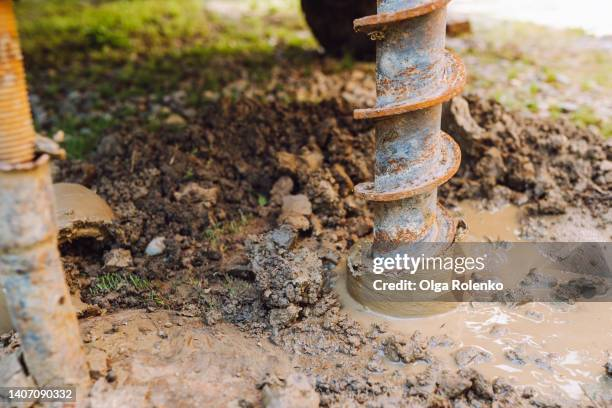
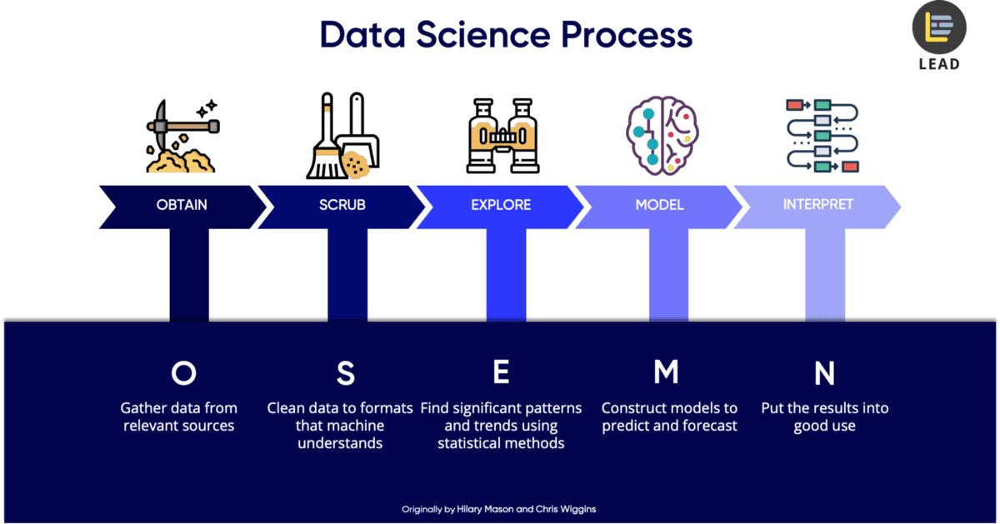
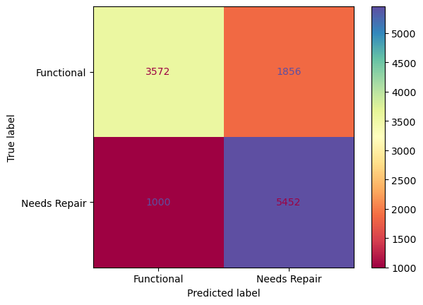
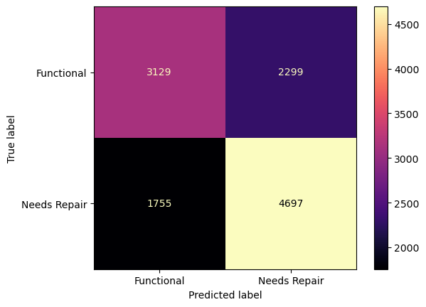

## Tanzanian Water Wells Project.

 ()

 # Brief Description

 The project entails: Business problem, Data, Methodology,Outcomes and Recommendations.

 # THE BUSINESS PROBLEM.
 
 - Tanzania has been facing problems with Water supply due to failure of Water pumps within their wells, I will create a model that is will predict water wells that require repair.
 Recommendations derived are presented to the Tanzanian Government and NGO's responsible for immediate actions and solutions.

# METHODOLOGY.

- Data cleaning and preprocessing: Handling missing values, outliers, and categorical variables.
- Feature engineering: Extracting new features from existing data.
- Model selection: Choosing an appropriate machine learning model for predicting water well conditions.
- Model evaluation: Evaluating the performance of the chosen model.
- Model deployment: Deploying the model to predict water well conditions.

## MODELLING

# Decision Tree Model

- The Descesion Tree Model I have come up with has shown A level of accuracy higher than that of the other models in that the rate of True positive determined was Higher than compared to my Logistic Regression model.

# Logistic Regression Model

- The Logistic Regression Model I came up with had a problem converging thre coeeeficients and therefore would have come up with a highly Overfitting or Underfitting results.

## CONCLUSIONS AND RECOMMEDNTATIONS

1. I recomend my Decesion Tree Model For its preciseness in locating Waterwells Location and Functionality Status of the Pumps within the wells

2. Through  knowledge in this area I reccommend the use of Non-submissed Pumps because they break down faster, a factor caused by a drop in level of Water in the well hence they tend to suck up and pump mud causing clogging issues.

3. The most Probable cause of failing Pumps is as a result of Poor maintainance, I would recommend reshuffling the maintainance groups or deploying new maintainance groups fot thE Purpose.

